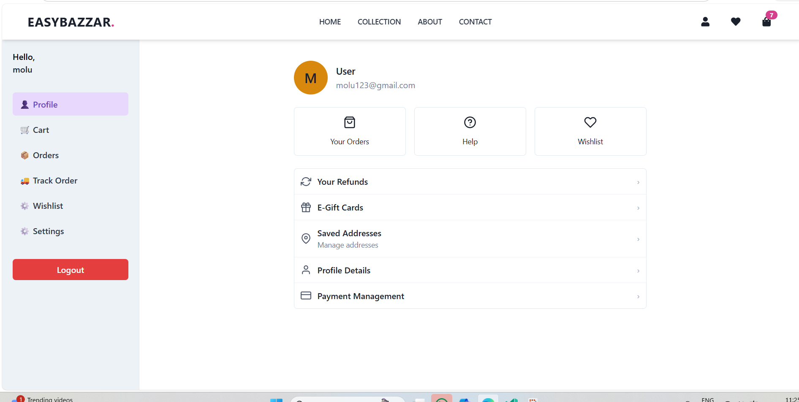

## EAZYBAZZAR 

EAZYBAZZAR is a modern e-commerce web application built with React (Vite), Firebase, Chakra UI, and Razorpay, designed to deliver a smooth and scalable online shopping experience.
The application features secure authentication, product collections, cart & order management, user dashboard, invoice download, smooth animations, and role-based access, with an Admin Dashboard for managing products, users, and orders.

## Features 

- **User Authentication (Firebase Auth)**
  - Signup, login, logout, password reset
  - Email verification & secure token-based sessions
- **Product Collections & Product Details**
  - Browse products with detailed views
  - Filter & search by category, price, or rating
- **Cart & Checkout**
  - Add/remove products, update quantities, view totals
  - Checkout integrated with COD 
- **Order Placement & Order Tracking & Invoice**
  - Place orders and track order history
  - Download PDF invoices instantly
- **User & Admin Dashboard**
  - **User:** Manage profile, orders, and addresses
  - **Admin (coming soon):** Manage products, orders management, users
- **Responsive Design**
  - Optimized for mobile & desktop
- **Role-Based Access Control**
  - Separate User & Admin permissions

## Tech Stack

- **Frontend:** React (Vite), Chakra UI, Framer Motion
- **Backend & Database:** Firebase (Firestore, Auth, Storage)
- **PDF Generation:** jsPDF

## Photos

### 🏠 Home Page


### 🛍 Collection Page


### ✅ User Dashboard Page



## Getting Started

**Prerequisites**

- Node.js (v18+ recommended)
- npm or yarn
- Firebase project with Authentication & Firestore enabled

## Installation

### 1. Clone the repository
```bash
git clone https://github.com/krijagriti30/eazybazzar.git
cd eazybazzar
```
### 2. Install dependencies 
```bash
npm install
```
### 3. Setup Firebase
- Create a Firebase project.
- Enable Authentication (Email/Password).
- Enable Firestore Database.
- Enable Firebase Storage (if used).
- Copy your Firebase configuration and replace it in the project.
  
### 4. Environment Variables
Create a .env file in the root directory and add:
``` bash
VITE_FIREBASE_API_KEY=your_firebase_api_key
VITE_FIREBASE_AUTH_DOMAIN=your_auth_domain
VITE_FIREBASE_PROJECT_ID=your_project_id
VITE_FIREBASE_STORAGE_BUCKET=your_storage_bucket
VITE_FIREBASE_MESSAGING_SENDER_ID=your_sender_id
VITE_FIREBASE_APP_ID=your_app_id
```
### 4 . Run the project
Start the development server:
 ```bash
npm run dev
```
The application will run at:
``` bash
http://localhost:5173
```


